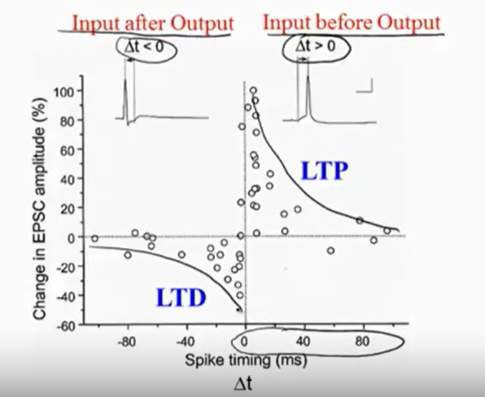

# Computational Neuroscience
## 1 Introduction & Basic Neurobiology
### 1.1 Introduction
There are 3 models to Receptive Fields:
- Descriptive Model (what)
- Mechanics Model (how)
- Interpretive Model (why)

**Receptive Field**: specific properties of a **sensory stimulus** that generate a strong responese from the cell.

### 1.2 Descriptive Model
On-center & Off-surround are actually equal relatively

Some receptive fields are **oriented**.

We can use a filter function to describle a receptive field.

### 1.3 Mechanistic & Interpretive Model
Mechanistic Model describes how the neural system does what we have observed it to do.

How LGN RF become V1 RF?

A simple model:

But Why those oriented RF look like that???

**Efficienc Coding Hypothesis**: Suppose the goal is to represent images *as faithfully and efficiently as possible* using neurons with receptive fields RF1, RF2, ...

> Sparse coding, ICA, Predictive coding

Use linear combination of $RF_i$ *to build any RF we want*, they are the basis.
$I = \Sigma _i k_i RF_i$

Interpretive models can give us insights that may be difficult to derive from strict empirical measurements alone (it's from human wise).

### 1.4 The Electrical Personality of Neurons
> Cerebellum 小脑; Cortex 皮质; Tectum 顶; Dentrity 树突; Axon 轴突; Myelin 髓磷脂; Ranvier 郎飞结; synapse 突触； cell membrane 细胞膜; lipid 脂类; electric potential 电势;

Neuron Doctrine:
- ~ is fundamental strucural
- ~ is discrete, not continuous
- info flows from dentrities to the axon via ~

The Idealized Neuron: Spikes (output) from a neuron occur when the *sum of inputs from neighboring neurons reaches a certain threshold*.

Difference of two sides of cell membrane. **Ionic Pump** maintains -70mV inside, **Ionic Channels** only allows specific ions to pass through, so they are *gated*, there are 3 kinds:
- Voltage-gated
- Chemically-gated
- Mechanically-gated 

> The Outside is like sea water(salty water).

**Sypapse**: Junction between neurons. spike occurs by depolarization and hyperpolarization (positive or negative change), Na+ influx, then K+ outflux.

> Action Potential itself doesn't carry infomations, but the combinations carry it.

Myelin enables *fast long-range spike communication*, it protect the axon and hold the electrical potential. Axon enables *lossless signal propagation*.

### 1.5 Making Connections: Synapses
> plasticity 可塑性; EPSP(Excitatory Postsynaptic Potential) 兴奋性突触后电位

Two kinds of synapses:
- Electrical synapses: use gap juntions (ionic channels).
- Chemical synapses: use neruotransmitters (some molecules).

why use Chemical synpases, which is so complex?
Chemical synapses can control the amount of molecules, therefore switch on/off.

the transmission: Input spike => neurotransmitter release => binds to ion channel receptors => Ion channels open => Na+ influx => deplorization

**Synpase Doctrine**: ~ are the basis for memory and learning.

**Hebbian's Synaptic Plasticity**: Repeat firing from neuron A to B, the synapse between is strengthened.

evidences of Hebbian's plasticity: EPSP change
- Long Term Potentiation(LTP): experimentally observed *increase* in synaptic strength that lasts for hours or days
- Long Term Depression(LTD): experimentally observed *decrease* ~

LTP/LTD depends on the **relative timing** of input and output spikes: Input before Ouput cause LTP; Input after Output cause LTD. Synapses are very sentitive about timming!

How neurons and synapses become perception, behavior? we dont know much...

### 1.6 Time to Network: Brain Areas and their Function
> perihery 外围的; somatic 躯体的; Medulla Oblongata 延髓; Pons 桥脑; Cerebellum 小脑; Midbrain 中脑；Reticular Formation 网状结构; Thalamus 丘脑; Hypothalamus 下丘脑; Cerebral Cortex 大脑皮层

Arch:

Cerebral Cortex is a layered sheet of Neurons, approximately 30 billion neurons, each about 10k synapses. There are *six layers*

> CNN has sparse connections, How about LLMs?

